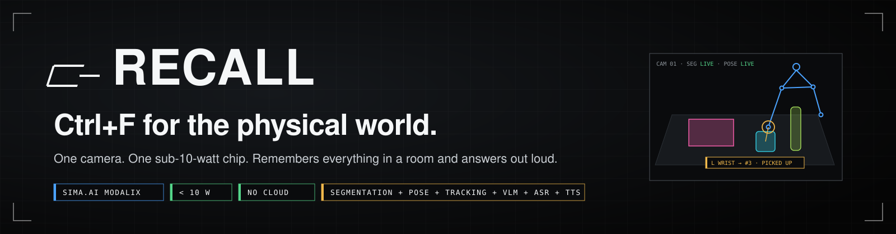
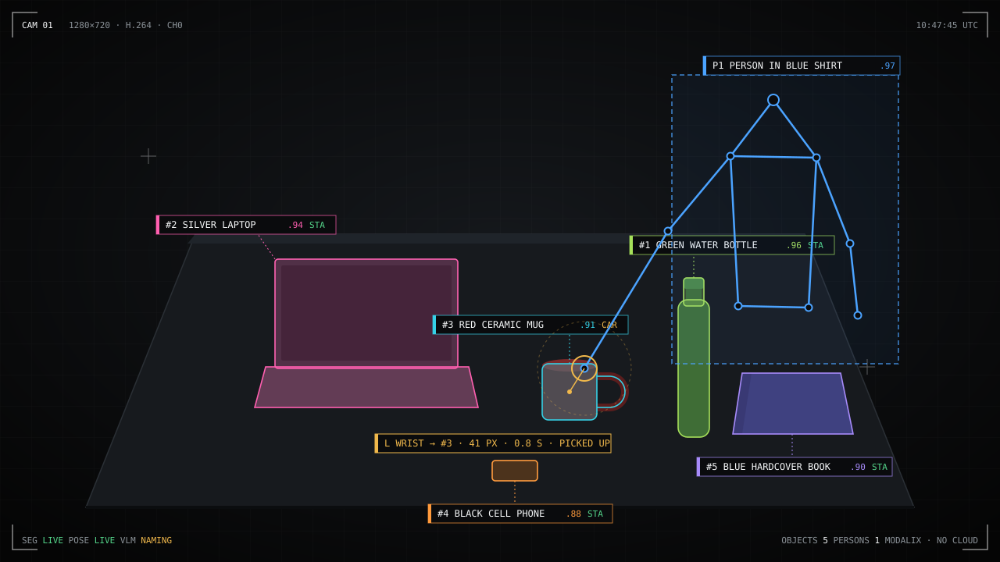
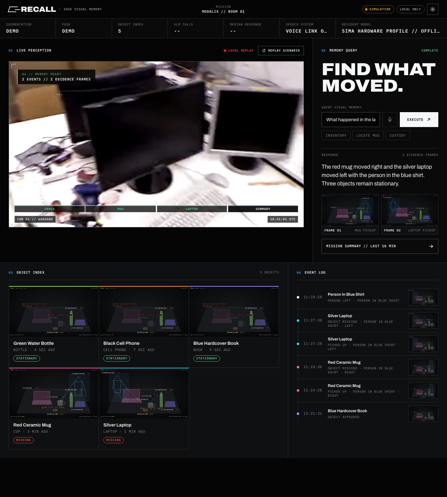
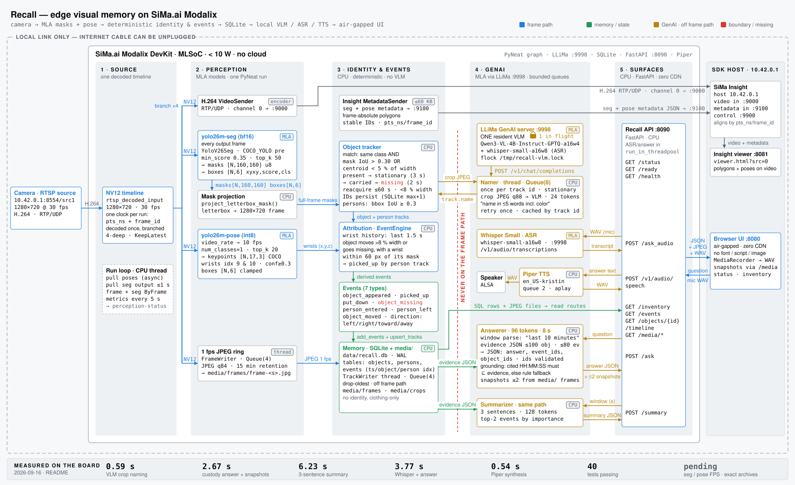

<p align="center">
  
</p>

<p align="center">
  <a href="https://vnmoorthy.github.io/recall/"></a>
  <a href="https://vnmoorthy.github.io/recall/app.html"></a>
  <a href="https://claude.ai/artifact/EsqEXESghPZp9JTkayKznM"></a>
  
  
  
  
</p>

<h3 align="center">A camera on one sub-10-watt chip that remembers everything in a room<br>and answers questions out loud, with the snapshot and the moment.</h3>

<p align="center">
  <b>“What's on the table?” &nbsp;·&nbsp; “Where's my red mug?” &nbsp;·&nbsp; “Who took the laptop?” &nbsp;·&nbsp; “What happened here in the last ten minutes?”</b>
</p>

<br>

<p align="center">
  
</p>

<table align="center"><tr>
<td><b>Q</b></td><td>Where is the red mug?</td></tr><tr>
<td><b>A</b></td><td>The person in the blue shirt picked up the red ceramic mug at 10:47:45 and moved right. It is now marked missing. <i>(1 snapshot · event #8)</i></td>
</tr></table>

<br>

## Why this cannot exist in the cloud

Continuous visual memory of a home, a hospital ward, a lab, or a stockroom is the most useful thing a camera could do. Nobody will stream that video to a server. So the memory has to live where the camera is.

Recall runs entirely on a [SiMa.ai Modalix](https://sima.ai) MLSoC. The runtime has no cloud client. The UI loads nothing from a CDN, not a font, not a script, not an image. Frames are kept at 1 fps for 15 minutes, then deleted. People are described by clothing only, never identity. Pull the internet cable mid-demo and it keeps answering.

## Try it in your browser

**[Launch the interactive demo →](https://vnmoorthy.github.io/recall/app.html)**

With no DevKit attached, the app runs a labeled `SIMULATION` replay of the four-stage scenario: five objects indexed, the mug taken, the laptop taken, then the summary. Ask it anything by text. Connect a board and the same page upgrades to live perception in place.

<p align="center">
  <a href="https://vnmoorthy.github.io/recall/app.html"></a>
</p>

[Animated walkthrough (GIF)](demo/recall-product-demo-preview.gif) · [1280×720 MP4](demo/recall-product-demo.mp4) · [Presenter script](docs/DEMO_SCRIPT.md) · [Verification guide](docs/VERIFY_PRODUCT.md) · [Pitch deck](https://claude.ai/artifact/EsqEXESghPZp9JTkayKznM) · [Submission copy](docs/submission.md)

## One chip, seven jobs

Every model on the Modalix has a job no other model can do.

| Model | Runs | Job in Recall |
|---|---|---|
| **YOLO26 instance segmentation** | every frame, on the MLA | The inventory. Pixel masks, boxes, one persistent identity per object. |
| **YOLO26 pose** | 10 fps, on the MLA | The attribution. 17 keypoints; only the wrists matter. |
| **Tracker** | CPU, on the frame path | The spine. Stable IDs through occlusion and re-entry within 60 s. |
| **Qwen3-VL-4B** via LLiMa | once per object, worker thread | Names things in ≤ 5 words with their color. People by clothing only. |
| **Same model, text mode** | per question | Answers over evidence JSON. Cites event IDs. Timestamp-grounded. |
| **Whisper Small** | on the MLA | Spoken questions. |
| **Piper** | CPU | Spoken answers. |

The vision-language model is never on the frame path. Stop it, and inventory and events keep flowing.

## Architecture

<picture>
  <source media="(prefers-color-scheme: dark)" srcset="docs/architecture-dark.svg">
  
</picture>

### Identity is the hard part

A mug must stay `#3` through lighting flicker, a hand passing over it, and a trip off screen.

- **Match**: same class and mask IoU > 0.30, or centroid within 5 % of frame width.
- **State machine**: `present` → `stationary` after 3 s → `carried` when a wrist is near → `missing` after 2 s unseen. Reacquire within 60 s and 8 % of the last position; otherwise a new track is born and the old one keeps its history.
- **Attribution**: an object moves or vanishes while any wrist of person *P* was within 60 px of its mask in the last 1.5 s → `picked_up(object, P)`, with the exit direction (left, right, toward, away).
- **Naming** happens once per track, only after it is stationary, single-flight, 24 tokens, cached by track ID.

### Answers come from evidence, not from a caption

The model never sees the video. It receives a compact evidence JSON from SQLite, sized to the window the question implies, and must reply with `answer`, `event_ids`, and `object_ids`. Every cited ID is validated, every quoted time must exist in the evidence, and a hallucinated time triggers deterministic evidence rendering instead of prose.

```json
{
  "answer": "The silver laptop was picked up by the person in the blue shirt at 01:36:21.",
  "event_ids": [8, 9, 10],
  "object_ids": [2],
  "snapshots": [{"event_id": 8, "frame_path": "frames/laptop-pickup.jpg"}],
  "window": 900,
  "vlm_ms": 2890.3
}
```

## Measured on the board

Taken 2026-09-16 on a connected Modalix DevKit, with a fallback VLM resident while the exact Qwen3-VL package awaited a SiMa login.

| Path | Result |
|---|---:|
| Custody question, evidence + snapshots | **2.67 s** |
| Whisper Small transcription + answer | **3.77 s** |
| Three-sentence summary | **6.23 s** |
| VLM crop naming | **0.59 s** |
| Piper speech synthesis | **0.54 s** |
| Text generation | **32.8 tok/s** |
| Test suite | **40 passed**, 1 hardware gate skipped |

Segmentation and pose FPS with the exact YOLO26 archives: **pending** until the DevKit reconnects and runs the staged packages. See [Verification gates](#verification-gates).

## Quickstart

Requirements: a Modalix DevKit with the SiMa Neat SDK container on the host, `pyneat` in `~/pyneat` on the board, and the shared `/workspace` NFS mount. The observed direct-link addresses are `10.42.0.1` (SDK host) and `10.42.0.232` (DevKit).

**1. Install the precompiled models.** Nothing is compiled or quantized. Authenticate when prompted.

```bash
cd /workspace/recall
SIMA_CLI_CHECK_FOR_UPDATE=0 sima-cli download -d models \
  'https://docs.sima.ai/pkg_downloads/SDK2.1.3/models/modalix/yolo26-segmentation/yolo26m-seg-bf16-b1.tar.gz'
SIMA_CLI_CHECK_FOR_UPDATE=0 sima-cli download -d models \
  'https://docs.sima.ai/pkg_downloads/SDK2.1.3/models/modalix/yolo26-pose/yolo26m-pose-int8-b1.tar.gz'
ssh sima@10.42.0.232 'llima pull Qwen3-VL-4B-Instruct-GPTQ-a16w4'
```

The two YOLO26 archives were downloaded and gzip-validated into the shared `models/` directory on 2026-09-16 and are staged for the next hardware launch:

```text
41bebbecca2f20de40c76d4bc6656c3fe369f9c139929dad93922492efa9b591  yolo26m-seg-bf16-b1.tar.gz
dd516a687ef1a7efa3f40da5e459541aa1d2c78fcb2ecce8de74bdbe80c7a1e1  yolo26m-pose-int8-b1.tar.gz
```

**2. Start the real product from the SDK host.** The launcher checks the two model archives, starts the DevKit services, waits for hardware mode with nonzero segmentation and pose FPS, and starts the local UI. `run_devkit.sh` prefers Qwen, then Gemma, then deterministic evidence rules. On a fresh board, install local speech once with `./setup_tts_devkit.sh`.

```bash
cd /workspace/recall
./start_live_product.sh
```

**3. Open the UI** at the URL printed by the launcher.

The default is `http://127.0.0.1:8080/app.html`. The public GitHub Pages site is a recorded simulation and is not a substitute for this directly connected URL.

| Surface | URL |
|---|---|
| Recall UI | `http://127.0.0.1:8080/app.html` (product site at `/`) |
| Recall API docs | `http://10.42.0.232:8090/docs` |
| Insight control | `https://127.0.0.1:9900` |
| Insight viewer | `https://127.0.0.1:8081/static/viewer.html?mode=light&src=0&max_channels=4` |

Use `./run_devkit.sh --restart` after deploying code, `./stop_devkit.sh` for a clean shutdown, and `./demo_live.sh --prepare` to seed fresh evidence and run the presentation smoke test.

## API

```bash
curl http://10.42.0.232:8090/inventory
curl 'http://10.42.0.232:8090/events?window=900&limit=500'
curl 'http://10.42.0.232:8090/objects/1/timeline?limit=500'
curl -H 'Content-Type: application/json' -d '{"question":"Who took my laptop?"}' http://10.42.0.232:8090/ask
curl -F 'file=@question.wav;type=audio/wav' http://10.42.0.232:8090/ask_audio
curl -H 'Content-Type: application/json' -d '{"window":900}' http://10.42.0.232:8090/summary
curl -o answer.wav -H 'Content-Type: application/json' -d '{"input":"Recall is ready.","response_format":"wav"}' http://10.42.0.232:8090/v1/audio/speech
```

`/health`, `/ready` (503 when a local component is down), and `/status` (fps, VLM latency, resident model) round it out. Every VLM prompt, response, token cap, and latency is appended to `logs/vlm.jsonl`.

## Repository

```
recall/
  perception.py   one PyNeat graph: decode once → seg, pose, H.264, 1 fps frame ring
  tracker.py      object + person tracks, stationary / carried / missing state machine
  events.py       typed events, wrist attribution, exit direction
  namer.py        single-flight VLM naming, cached per track
  answerer.py     window parse → evidence JSON → VLM → grounded answer + snapshots
  summarizer.py   three sentences, top-2 events by importance
  memory.py       SQLite: objects, persons, events, frame retention
  api.py          FastAPI on :8090
  actions.py      Piper speech, media writers
ui/               air-gapped browser UI (zero external requests), deployed to GitHub Pages
docs/             architecture, demo script, submission copy, audit ledgers
tests/            40 unit and contract tests, 1 hardware-gated e2e
```

## Privacy and retention

- Runtime requests stay on the DevKit / SDK-host link. No cloud client exists in the codebase.
- People receive clothing-only descriptions. No identity, no protected attributes, no biometrics stored.
- Full frames are retained at 1 fps for 15 minutes and deleted by a bounded writer.
- The simulation and hardware databases are isolated (`recall-demo.db` vs `recall.db`), so rehearsals cannot overwrite real history.

## Verification gates

We report what is measured, not what is planned.

| Gate | Status | Evidence / remaining work |
|---|---|---|
| M0 baselines | NOT VERIFIED | Exact seg and pose packages are staged in `models/`; their live run and the Qwen pull await DevKit reconnection. Insight H.264 ingest and crop VLM verified. |
| M1 tracking | PARTIAL | Mask and tracker tests pass; combined worker exists. Real IDs, 60 s churn, and seg FPS await models. |
| M2 events | PARTIAL | Attribution, direction, empty-scene, carried, and put-down gates pass. Recorded human clip awaits assets. |
| M3 naming / memory | PARTIAL | MLA crop naming and one-call audit pass; 4-of-5 color-name gate awaits perception models. |
| M4 answers / speech | VERIFIED (fallback VLM) | 12-question evidence gate passes; typed answer, summary, Whisper, Piper, snapshots, sub-8 s warm responses. |
| M5 API / UI | PARTIAL | API and zero-CDN UI run; WAV mic path works. The in-app system check (header checkmark) reports local and hardware readiness; browser MediaRecorder needs a human pass. |
| M6 live camera | NOT VERIFIED | Five repeated physical runs need a connected camera, DevKit, and people. |

Run the suite on the DevKit with a unique cache dir (NFS can expose stale bytecode between the SDK container and the board):

```bash
ssh sima@10.42.0.232 'cd /workspace/recall && source ~/pyneat/bin/activate && PYTHONPYCACHEPREFIX=/tmp/recall-test-$$ python3 -m pytest -q'
```

## Roadmap

- Multi-camera memory through the Modalix PCIe card, objects followed across rooms.
- Depth Anything on the MLA for metric spatial language: “left shelf, second bin”.
- Open-vocabulary segmentation for domain inventory: instruments, pumps, tools, parts.
- Policy-controlled retention and role-based evidence access.
- Fleet-local analytics without centralizing raw video.

## Credits

Built at the [AI Infra Summit Hackathon 2026](https://lablab.ai/ai-hackathons/ai-infra-summit-hackathon), Santa Clara, on the SiMa.ai track, with the Modalix DevKit, Palette Neat SDK, and LLiMa.

The offline replay video is adapted from the TUM RGB-D `freiburg1_desk` sequence by J. Sturm et al. (transcoded to VP9), licensed under [CC BY 4.0](https://creativecommons.org/licenses/by/4.0/). Dataset and citation: [TUM Computer Vision Group](https://cvg.cit.tum.de/data/datasets/rgbd-dataset).

Archivo and IBM Plex Mono are used under the SIL Open Font License (see `ui/fonts/OFL.txt`).
