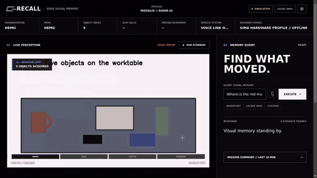

# Recall

**Ctrl+F for the physical world.** Recall is a private visual memory for rooms,
running on a SiMa.ai Modalix DevKit. It maintains a masked object inventory,
attributes object movement to nearby wrists, remembers events in SQLite, and
answers typed or spoken questions with supporting snapshots.

The product thesis is simple: continuous visual memory is not acceptable when
home, hospital, lab, workshop, or stockroom video must be streamed to a cloud
service. Recall keeps video, descriptions, questions, and speech inside the
local network. The runtime contains no cloud client and the UI has no CDN,
external font, script, or image dependency.

## Interactive Demo

**[Launch Recall in your browser](https://vnmoorthy.github.io/recall/)**

[](https://vnmoorthy.github.io/recall/)

[Watch or download the 1280x720 MP4](demo/recall-product-demo.mp4) ·
[Presenter script](docs/DEMO_SCRIPT.md) ·
[Reusable browser recorder](tools/record_demo.py)

This recorded cut demonstrates the offline `SIMULATION` workflow and labels it
accordingly. A connected-DevKit recording should replace it only after the live
hardware gates pass.

## Current State

This workspace has a usable hardware-backed product with a synthetic perception
fallback. On the connected DevKit at `10.42.0.232`:

- Gemma 4 E2B is resident on the MLA as the temporary VLM fallback.
- Whisper Small is resident on the MLA and transcribes through port 9998.
- Piper runs locally on the DevKit and serves WAV speech through Recall.
- An Insight-hosted 640x480 H.264 recording is relayed to channel 0.
- The API, memory, question, summary, speech, and air-gapped UI paths work.
- The aerospace operations UI auto-plays a four-stage local replay when the
  DevKit link is unavailable. It advances the inventory, custody events,
  evidence, and summary in place, and upgrades to live data when the API returns.
- The exact YOLO26 segmentation/pose archives and Qwen3-VL model are not
  installed because SiMa device authentication requires a human login.

When both YOLO archives appear in `models/`, `run_devkit.sh` automatically stops
the preview relay and starts the combined hardware perception worker. No source
change is required.

## Architecture

```text
Insight RTSP / camera
        |
        v
one decoded NV12 PyNeat timeline on Modalix
        |
        +---- H.264 VideoSender ----------------------> Insight :9000
        |
        +---- yolo26m-seg (every output frame) -------+--> mask/object tracker
        |                                              |    +--> SQLite events
        +---- video_rate -> yolo26m-pose (10 fps) -----+    +--> Insight :9100
        |                                                   +--> 1 fps JPEG ring
        +---- decoded frame --------------------------------+--> bounded VLM namer

SQLite memory --> compact evidence JSON --> Qwen3-VL/Gemma text on MLA --> answer
microphone ----> Whisper Small on MLA ----> same answer path ------------> Piper

Browser :8080 --> Recall API :8090 --> local media
              --> Insight viewer :8081
```

Segmentation and pose share one run and one source clock so metadata aligns with
the encoded preview. Run queues are bounded and keep the latest frame. Disk
encoding, VLM naming, speech, question answering, and summaries stay off the
frame path. Object identity uses same-class mask IoU or centroid distance,
stationary naming, a 60-second reacquisition window, and persistent IDs.

## Reference Contracts

The implementation follows the installed Neat examples under
`/neat-resources/apps-src/examples` (the brief's `prebuilt-apps` path is absent):

1. `YoloV26Seg` uses COCO-YOLO preprocessing from NV12.
2. Segmentation boxes are `[N,6]`: `x1,y1,x2,y2,score,class_id`.
3. Segmentation masks are `[N,160,160]` uint8 mask heads.
4. Mask heads are projected from letterboxed model space into frame space.
5. Insight receives frame-absolute polygons with stable object IDs.
6. `YoloV26Pose` sets `num_classes=1`.
7. Pose keypoints are `[N,17,3]` in COCO order; wrists are indices 9 and 10.
8. Pose boxes are clamped; visibility filters reject unreliable wrists.
9. Pulled samples preserve `pts_ns` and `frame_id` for Insight correlation.
10. Naming is single-flight, bounded, retried once, and cached by track ID.

## Install The Missing Models

Do not compile or quantize these models. From the SDK container, authenticate
when prompted and download the exact precompiled packages:

```bash
cd /workspace/recall
SIMA_CLI_CHECK_FOR_UPDATE=0 sima-cli download -d models \
  'https://docs.sima.ai/pkg_downloads/SDK2.1.3/models/modalix/yolo26-segmentation/yolo26m-seg-bf16-b1.tar.gz'
SIMA_CLI_CHECK_FOR_UPDATE=0 sima-cli download -d models \
  'https://docs.sima.ai/pkg_downloads/SDK2.1.3/models/modalix/yolo26-pose/yolo26m-pose-int8-b1.tar.gz'
```

On the DevKit, install the requested resident VLM:

```bash
ssh sima@10.42.0.232
llima pull Qwen3-VL-4B-Instruct-GPTQ-a16w4
```

`run_devkit.sh` prefers Qwen automatically, then Gemma, then deterministic
evidence rules. Whisper is expected at
`/media/nvme/llima/models/whisper-small-a16w8`. The reviewed Piper worker and
public-domain Kristin voice are vendored from the installed Neat GenAI Studio;
their model binaries are installation artifacts and are gitignored.

## Run

Start the board services from the SDK container:

```bash
ssh sima@10.42.0.232 \
  'cd /workspace/recall && source ~/pyneat/bin/activate && ./run_devkit.sh'
```

Use `./run_devkit.sh --restart` after deploying code or changing resident models.
Use `./stop_devkit.sh` for a clean shutdown. On a fresh board, install local
speech once with `./setup_tts_devkit.sh`.

Start the UI in the SDK container (the shared Mac workspace can run the same
command):

```bash
cd /workspace/recall
./run_mac.sh
```

Open:

- Recall UI: `http://127.0.0.1:8080`
- Recall API docs: `http://10.42.0.232:8090/docs`
- Insight control: `https://127.0.0.1:9900`
- Insight viewer: `https://127.0.0.1:8081/static/viewer.html?mode=light&src=0&max_channels=4`

With the DevKit disconnected, the UI is explicitly labeled `SIMULATION` and
starts the four-stage scenario automatically. `REPLAY SCENARIO` runs it again;
typed queries, object timeline filtering, evidence, and summaries remain
interactive. Voice input stays disabled until the SiMa runtime is connected.

The local replay video is adapted from the TUM RGB-D `freiburg1_desk` sequence
by J. Sturm et al. (transcoded to VP9), licensed under
[CC BY 4.0](https://creativecommons.org/licenses/by/4.0/). The dataset and
required publication citation are available from the
[TUM Computer Vision Group](https://cvg.cit.tum.de/data/datasets/rgbd-dataset).

The observed direct-link addresses are `10.42.0.1` for the SDK host and
`10.42.0.232` for the DevKit, replacing the stale `192.168.1.x` values in the
initial brief.

## API Examples

```bash
curl http://10.42.0.232:8090/health
curl http://10.42.0.232:8090/ready
curl http://10.42.0.232:8090/inventory
curl 'http://10.42.0.232:8090/events?window=900&limit=500'
curl 'http://10.42.0.232:8090/objects/1/timeline?limit=500'

curl -H 'Content-Type: application/json' \
  -d '{"question":"Who took my laptop?"}' \
  http://10.42.0.232:8090/ask

curl -F 'file=@question.wav;type=audio/wav' \
  http://10.42.0.232:8090/ask_audio

curl -H 'Content-Type: application/json' -d '{"window":900}' \
  http://10.42.0.232:8090/summary

curl -o answer.wav -H 'Content-Type: application/json' \
  -d '{"input":"Recall is ready.","response_format":"wav"}' \
  http://10.42.0.232:8090/v1/audio/speech
```

Question responses have this evidence-bearing shape:

```json
{
  "answer": "The silver laptop was picked up by the person in the blue shirt at 01:36:21.",
  "event_ids": [8, 9, 10],
  "object_ids": [2],
  "snapshots": [{"event_id": 8, "frame_path": "frames/laptop-pickup.jpg"}],
  "window": 900,
  "vlm_ms": 2890.3
}
```

All VLM naming, answer, and summary prompts, responses, errors, token caps, and
latencies are appended to `logs/vlm.jsonl`.

## Demo Script

Prepare fresh evidence and run the complete presentation smoke test from the
DevKit with one command:

```bash
ssh sima@10.42.0.232 'cd /workspace/recall && ./demo_live.sh --prepare'
```

Use `./demo_live.sh` without `--prepare` for a fast check that preserves the
running processes.

1. Show the five objects and ask, "What's on the table?"
2. Move the mug out of frame and ask, "Where is the red mug?"
3. Have a person take the laptop and ask, "Who took my laptop?"
4. Disconnect upstream Ethernet and repeat step 3.
5. Ask, "What happened here in the last ten minutes?"

The synthetic fallback starts with this exact evidence state, including the two
pickup frames, so the complete interaction can be rehearsed before the exact
vision packages and human recordings are installed.

## Measured Results

Measurements below were taken on 2026-09-16 on the connected Modalix board.

| Path | Result |
|---|---:|
| Gemma cold model load | 3.536 s |
| Gemma text warmup TTFT | 0.21 s |
| Gemma measured generation | 32.83 tokens/s |
| VLM crop naming (`Red mug icon`) | 0.594 s |
| Custody question, evidence + snapshots | 2.669 s |
| Three-sentence summary | 6.230 s |
| Whisper Small transcription + answer | 3.774 s |
| Piper post-prewarm synthesis/API call | 0.539 s |
| Piper model warmup | asynchronous during service startup |
| Test suite | 40 passed, 1 hardware-recording gate skipped |

The active MLA shared-memory service is `simaai-appcomplex.service`. Observed
process RSS was approximately 158 MB preview, 471 MB GenAI server, and 173 MB
API/Piper client. The board reported 5.8 GiB RAM and no swap. Exact segmentation
and pose FPS remain **NOT VERIFIED** until their authenticated archives arrive.

## Verification Gates

| Gate | Status | Evidence / remaining work |
|---|---|---|
| M0 baselines | NOT VERIFIED | Exact segmentation, pose, and Qwen packages require SiMa login. Insight H.264 ingest and Gemma crop VLM are verified. |
| M1 tracking | PARTIAL | Mask/tracker tests pass; combined worker exists. Five real IDs, 60-second churn, and seg FPS await models/clip. |
| M2 events | PARTIAL | Unit attribution, direction, empty-scene, carried, and put-down gates pass. Recorded human clip awaits assets. |
| M3 naming/memory | PARTIAL | MLA crop naming and one-call audit pass; 4-of-5 real color-name gate awaits perception models. |
| M4 answers/speech | VERIFIED WITH FALLBACK VLM | 12-question evidence gate passes; typed answer, summary, Whisper, Piper, snapshots, and sub-8-second warm responses verified. Final Qwen substitution remains. |
| M5 API/UI | PARTIAL | API and zero-CDN UI run; WAV microphone path works. Browser MediaRecorder and unplugged-browser inspection need a human browser pass. |
| M6 live camera | NOT VERIFIED | Five repeated physical runs and backup recording need camera, people, and installed vision packages. |
| M7 polish | PARTIAL | Status UI, this README, and `docs/deck.md` are complete; final real FPS belongs in both. |

## Tests

Run on the DevKit with a unique cache directory. NFS can otherwise expose stale
Python bytecode between the SDK container and board:

```bash
ssh sima@10.42.0.232 '
  cd /workspace/recall
  source ~/pyneat/bin/activate
  export PYTHONPYCACHEPREFIX=/tmp/recall-test-cache-$$
  python3 -m pytest -q
'
```

The recorded test remains skipped until all three input assets exist. Once an
operator streams `assets/demo_clips/person-takes-laptop.mp4` through Insight:

```bash
RECALL_HARDWARE_E2E=1 python3 -m pytest -q tests/test_e2e_recorded.py
```

## Privacy And Retention

- Runtime requests remain on the DevKit/SDK-host link.
- People receive clothing-only descriptions, never identity or protected traits.
- SQLite stores object/person tracks and event references, not biometric identity.
- Full frames are retained at 1 fps for 15 minutes and deleted by a bounded writer.
- Naming works once per track; stopping the VLM does not stop tracking or events.
- The synthetic and hardware databases are isolated as `recall-demo.db` and
  `recall.db`, so rehearsals cannot overwrite real history.

See `docs/deck.md` for the six-slide presentation outline,
`docs/iterations-50.md` and `docs/iterations-100.md` for both product-audit
rounds, and `config.yaml` for all source, model, tracking, memory, API, and
Insight settings.
